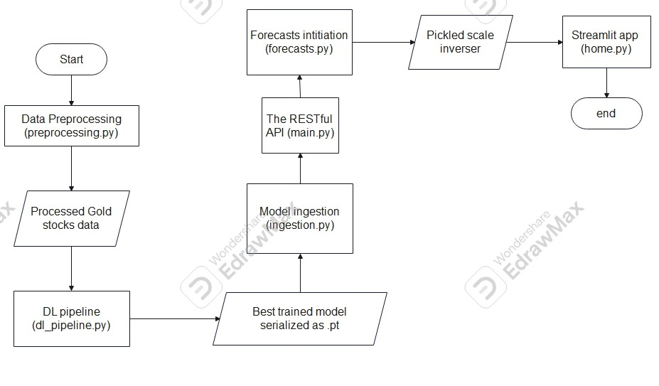
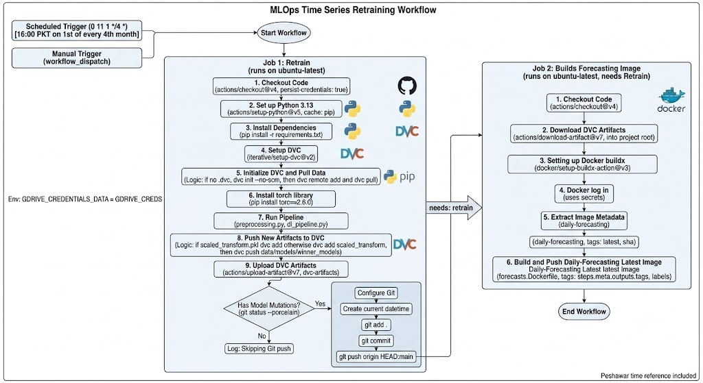
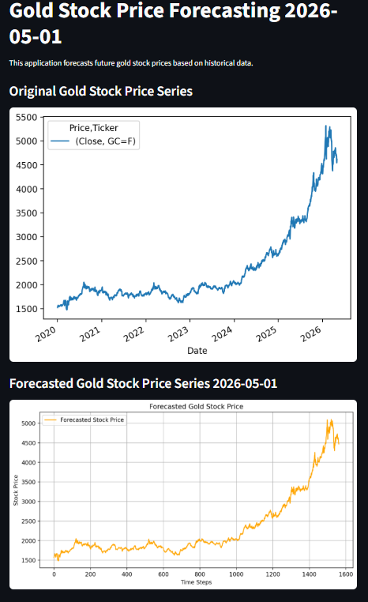

# MLOps based gold stock forecasting

## Introduction

## 🔬 Methodology

My approach included:

1. **Data Ingestion and Preprocessing**:
I acquired the gold stock from 2010-01-01 to every current date using yfinance library, and then I performed preprocessing steps such as handling missing values, scaling the data, and creating sequences for time series forecasting.

2. **Model Development and Training**:
I developed and trained multiple deep learning models, including LSTM, GRU, and Conv1D architectures, to forecast the gold stock prices. I used a systematic approach to train and evaluate each model, ensuring that I selected the best-performing model based on evaluation metrics.

3. **Model Evaluation and Selection**:
I evaluated the performance of each model using appropriate metrics such as Mean Absolute Error (MAE) and Root Mean Squared Error (RMSE). Based on the evaluation results, I selected the best-performing model for deployment.

4. **Deployment and Monitoring**:
I deployed the selected model using FastAPI and Streamlit to create a user-friendly interface for forecasting. I also implemented monitoring mechanisms to track the performance of the deployed model and ensure that it continues to provide accurate forecasts over time. Then, I at first deployed them all to DVC based remote of the google drive, and then I containerized the entire architectural flow using Docker, and finally, I deployed the forecasting app to Kubernetes to simulate a cloud environment deployment.

## ⚙️ Architecture

### Overall architecture



### CI/CD workflow architecture



## Features

## 💻 Demo screenshot



## 📂 Project structure

```text
time-series-forecasting-mlops/
├── .dockerignore
├── .dvc/
│   └── .gitignore
├── .dvcignore
├── .github/
│   └── workflows/
│       └── actions.yaml
├── .gitignore
├── compose.yml
├── data.dvc
├── demos/
│   └── streamlit_app_running_screenshot.png
├── Dockerfile
├── forecasts.Dockerfile
├── forecasts.Dockerfile.dockerignore
├── k8s/
│   ├── deployment.yaml
│   └── service.yaml
├── LICENSE
├── models.dvc
├── notebooks/
│   └── timeseries_modelling.ipynb
├── README.md
├── requirements.txt
├── scaled_transform.dvc
├── scripts/
│   ├── __init__.py
│   ├── api/
│   │   ├── main.py
│   │   └── schemas.py
│   ├── app/
│   │   ├── home/
│   │   │   ├── daily_forecasts.py
│   │   │   └── home.py
│   │   └── server/
│   │       ├── forecasting.py
│   │       ├── latest_model_forecasting.py
│   │       └── server.py
│   ├── architectures/
│   │   ├── conv1d.py
│   │   ├── gru.py
│   │   └── lstm.py
│   ├── dl_pipeline.py
│   ├── evaluate.py
│   ├── ingestion.py
│   └── preprocessing.py
└── winner_models.dvc
```

## 🛠️ Installation Guide

### Method 1: Using git clone and pip install

```bash
git clone https://github.com/JackTheProgrammer/time-series-forecasting-mlops.git
cd time-series-forecasting-mlops
pip install --no-cache-dir --extra-index-url https://download.pytorch.org/whl/cpu torch==2.6.0
pip install --no-cache-dir -r requirements.txt
python scripts/api/main.py && streamlit run scripts/app/home/home.py
```

### Method 2: Using docker image

#### Pulling the image which runs the entire architectual flow

```bash
docker pull fawadawan143/fawadawan143/gold_stock_prediction:latest
docker run -p 8501:8501 5050:5050 fawadawan143/fawadawan143/gold_stock_prediction:latest
```

#### Pulling the image which is only for forecasting using the latest model

```bash
docker pull fawadawan143/daily-forecasting:latest
docker run -p 8501:8501 5050:5050 fawadawan143/daily-forecasting:latest
```

### Method 3: Using docker compose

```bash
git clone https://github.com/JackTheProgrammer/time-series-forecasting-mlops.git
cd time-series-forecasting-mlops
docker compose up --build -d
docker compose up -d ml-pipeline # This will start the entire architectural flow, including data ingestion, preprocessing, model training, and evaluation. The ml-pipeline service will run all the necessary steps to process the data, train the models, and evaluate their performance. You can monitor the logs of this service to see the progress of each step in the pipeline.
docker compose up -d forecasting-app # This will start the forecasting app service, which will run the forecasting app with the latest DVC and trsining artifacts.
```

To stop the services, you can use the following command:

```bash
docker compose down
```

### Method 4: Using kubernetes

```bash
git clone https://github.com/JackTheProgrammer/time-series-forecasting-mlops.git
cd time-series-forecasting-mlops
docker pull fawadawan143/daily-forecasting:latest # You can build your own as well, using the forecasts.Dockerfile and forecasts.Dockerfile.dockerignore files in the root directory of the project, and then tag it as daily-forecasting:latest, but my image is already available on Docker Hub, so no need to re-invent the wheel.
docker run -p 8501:8501 5050:5050 daily-forecasting:latest
minikube start --driver=docker # Start minikube with the Docker driver
kubectl apply -f k8s/ # Apply the Kubernetes deployment and service configurations in the k8s/ directory on the minikube cluster
minikube image load daily-forecasting:latest # Load the Docker image into minikube
# In an another command line tool window, do:
minikube tunnel # Start the minikube tunnel to access the LoadBalancer service, this simulates the cloud environment where LoadBalancer services are commonly used to expose applications to the internet. The tunnel will allow you to access the service using the external IP address assigned by minikube. once the tunnel is running, you can access the forecasting API at http://<minikube_ip>:80/forecast or http://<minikube_ip>:80/latest-forecast depending on the endpoint you want to use.
kubectl expose deployment gold-forecasting-deployment --type=LoadBalancer --port=80 --target-port=80
```

Now to end it all up after being done testing, do:

```bash
kubectl delete service gold-forecasting-deployment
kubectl delete deployment gold-forecasting-deployment
minikube stop
```

## Resources
